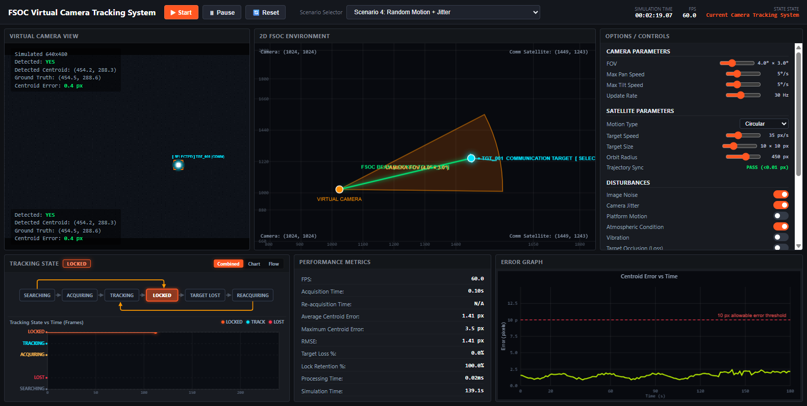

# FSOC Virtual Camera Tracking System
### AI-Based Coarse Alignment for Mobile Optical Terminals in Free Space Optical Communication (FSOC)



## Overview
Free Space Optical Communication (FSOC) offers ultra-high transmission bandwidth, high energy efficiency, and immunity to radio-frequency interference. However, pointing laser beams between mobile optical terminals requires high-precision acquisition, tracking, and pointing (ATP).

This project implements and evaluates a complete end-to-end software simulation pipeline:
1. **Synthetic Environment & Disturbance Modeling**: Simulates optical beacons, platform dynamics, atmospheric disturbances (fog, rain, low-light), and sensor noise.
2. **Classical Beacon Detection**: Morphological Top-Hat filtering combined with dynamic radiometric thresholding and spatial contour filtering.
3. **Sub-Pixel Centroid Estimation**: Center of Mass, Intensity-Weighted Centroid, and Gaussian 2D surface fitting.
4. **Temporal Tracking**: Kalman Filtering, centroid distance association, and occlusion handling.
5. **Virtual Two-Axis Pan-Tilt Alignment Controller**: Proportional-Integral-Derivative (PID) control driving line-of-sight stabilization within the optical receiver acceptance angle.
6. **Interactive Application Dashboard**: Real-time visualization, playback, and analysis web application.

---

## Architecture Pipeline

```text
Synthetic Environment & Disturbance Modeling
                     ↓
         Classical Beacon Detection
                     ↓
        Sub-Pixel Centroid Estimation
                     ↓
            Temporal Tracking
                     ↓
      Angular Alignment Error Calculation
                     ↓
      Virtual Two-Axis Pan-Tilt Controller
                     ↓
        Final Benchmark & Web Dashboard
```

---

## Installation & Setup

### Prerequisites
- Python 3.8+
- Recommended: Modern web browser (Chrome, Edge, Firefox)

### Install Dependencies
```bash
pip install -r requirements.txt
```

---

## Running the Application

### 1. Launch Interactive Dashboard (Default)
To start the dashboard web server and open the browser interface:
```bash
python run_fsoc_pipeline.py
```
Or directly:
```bash
python serve_dashboard.py
```
Open [http://localhost:8080/index.html](http://localhost:8080/index.html) in your browser.

### 2. Run Validation Tests
Run all validation checks across the pipeline:
```bash
python run_fsoc_pipeline.py --mode validate
```

### 3. Run Benchmark Suite
Run the full benchmark evaluation:
```bash
python run_fsoc_pipeline.py --mode benchmark
```

### 4. Run Full Pipeline
Generate synthetic datasets, run detection, tracking, alignment, and benchmarks end-to-end:
```bash
python run_fsoc_pipeline.py --mode full
```

---

## Project Structure
- `index.html`: Interactive web application dashboard for FSOC simulation analysis.
- `serve_dashboard.py`: Lightweight local HTTP server for the dashboard.
- `run_fsoc_pipeline.py`: Master pipeline runner (dashboard, validation, benchmark, full pipeline).
- `generate_dataset.py`: Synthetic optical dataset generator with environmental disturbances.
- `run_beacon_detection.py`: Morphological and radiometric beacon detector.
- `centroid_analysis.py`: Sub-pixel centroid estimation algorithms.
- `track_beacon.py`: Temporal multi-target tracker and Kalman filter.
- `alignment_controller.py`: Virtual 2-axis Pan-Tilt gimbal controller.
- `run_benchmark.py`: Comprehensive benchmark suite and metrics computation.
- `benchmarks/`: Benchmark evaluation reports, comparison tables, and sensitivity plots.
- `scenarios/`: Scenario definitions and multi-target configurations.
- `requirements.txt`: Python package requirements.
